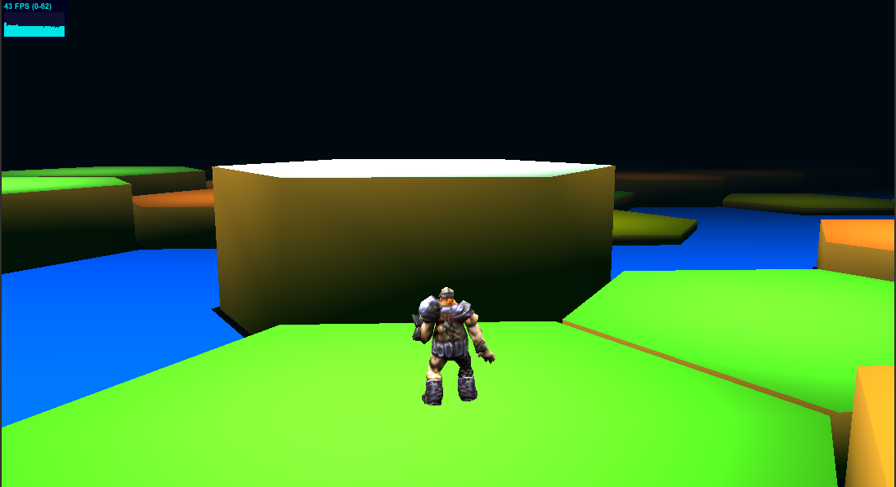

## hextiles-prototype (0.0.1-dev)

*Screenshot:*



You will need to pre-install the [three.js](http://threejs.org) library (r60 or better) and symlink it into the ```public``` folder so that the demo can find the files that it needs.

* this is a single-player demo (unfinished.. just trying out some features).
* type ```npm install``` then ```npm start``` to start the server (requires [node.js](http://nodejs.org))
* visit ```http://localhost:8000``` in your browser to start the demo

Use WASD or cursor keys to move around. 

_Collisions are not implemented so you can just run through things_
